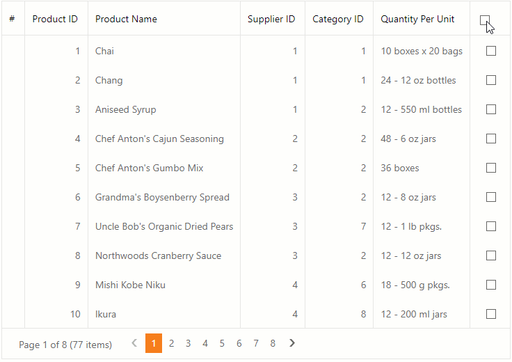

<!-- default badges list -->

<!-- default badges end -->
# Grid View for ASP.NET Web Forms - How to implement the Select All feature

This example demonstrates how to display the Select All checkbox in the Grid View control's column header.

In this example, the **Discontinued** column displays [checkboxes](https://docs.devexpress.com/AspNet/11415/components/data-editors/checkbox) in its cells. Click a checkbox in a data cell to change the selection state of the corresponding row. Click the checkbox in the column header to send a callback to the server and change the selection state of all grid rows.

## Files to Review

* [Default.aspx](./CS/Default.aspx) (VB: [Default.aspx](./VB/Default.aspx))
* [Default.aspx.cs](./CS/Default.aspx.cs) (VB: [Default.aspx.vb](./VB/Default.aspx.vb))

## Documentation

* [ASPxGridView](https://docs.devexpress.com/AspNet/DevExpress.Web.ASPxGridView)
* [Grid View - Examples](https://docs.devexpress.com/AspNet/3768/components/grid-view/examples)

## More Examples

- [How to Delete Selected Rows in a Grid](https://github.com/DevExpress-Examples/aspxgridview-delete-selected-rows)
<!-- feedback -->
## Does this example address your development requirements/objectives?

 

(you will be redirected to DevExpress.com to submit your response)
<!-- feedback end -->
